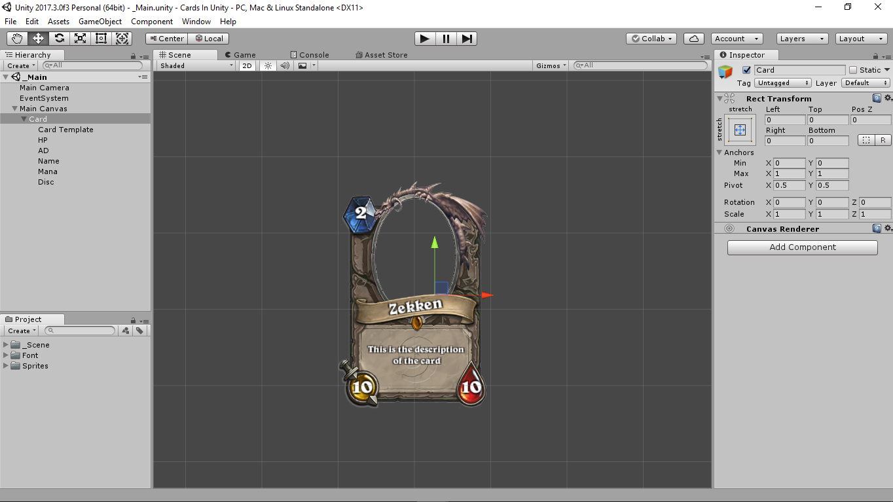
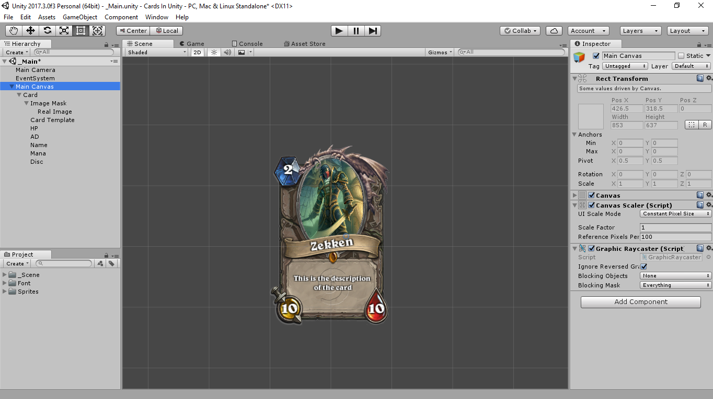

# Hearthstone Cards in Unity

## Preview
This section provide an overview of this project.

In this project i cloned a "Hearthstone" Card, and created a code that allow me to create an AssetMenu named Card .
this will help instead of creating multi cards each with its own prefab to create only one card prefab linked to any card i want.

So if you add the **Card** Scripts that exist in the **Scripts** folder then you right click you will see the option bellow:

Meanwhile the **Display** Script is the one responsable to show the card details in run time (Linking the Card as a UI with the card as a file ).
This will help with optimizing the game as said above , also the Tutorial bellow will help you create a UI Card.

## Tutorial
For those who are interested in making this from zero and how i did it ,this section is for you.
Please note that am only covering UI Card creation here and not really covering the code part. 
  #### Prerequisite
  1- You need to create a new game in unity ,and set it to 2D .
  
  2- Copy and paste the Sprites folder (if you dont have a design for your cards , and images ).
  
  ### Steps 
  1- After you create a game project in unity , select your **Main Camera** and change it's **Projection** to **Perspective** ; as this will help alot when using UI elements.
  
  2- Create a **Canvas** to hold our cards in it ,and rename it to **Main Canvas**.
  
  3- Create another **Canvas** inside of the **Main Canvas** ,and name it **Card**.
  
  4- Now lets play around with our **Card** (Card Canvas).
  - Start By deleting every component on the **Card** leaving only the **Rect Transform** component.
  - Add a **Canvas Renderer** from the **Add Component**.
  - Now create an **Image** inside of the **Card** , Name it **Card Template**.
  - From the **Image (Script)** Press **Source Image** and link it to the **Card** sprite that exist in the sprites folder(in case you want to use the same card image that i used).
  - Change the **Scale** of the image to fit the size you are looking for (in my case 2 from the X-Axis and 3 from the Y-Axis).
  
  5- Right click on the **Card** and add a **Text** from the **UI** tab then name it **HP**.
  
  6- Change it's text to 10 and align to be on the top of the red part of the **Card** , and choose the font you want (in my case i used the font from the **Font** folder above ) ,also change the color to white , and add an **Outline (Script)** from the **Add Component** then set the **Effect Distance** to what you want ( in my case X = 1.35 , Y = -2).
  
  7- Repeat **Step 6** for the name , attack points (Yellow part of the card) ,description , and mana (Blue part of the card) .
  - On finishing **Step 7** you are supposed to end up with something like this:
  
  
  9- Now for the Card image we are going to use a simple trick :
  - Start by right clicking on the **Card** create a **UI Image** then click on **Image (Script)** and link the **Source Image** with the **Card Image Mask** that exist in the **Sprites** folder.
  - ReScale the image to fit in the **Card Template** Gap , then click on it in the **Hierachy** and pull it to be above the **Card Tempalte** ; in order to sort the layers.
  - Now click on **Add Components** and add **Mask (Script)** , then uncheck **Show Mask Graphic** .
  - Create another **UI Image** as a child for the Image we created above ,and link it with **Zekken** image that exist in the **Sprites** folder.
  
  10- The final product should look something similar to this:
  
  
  
  
  
